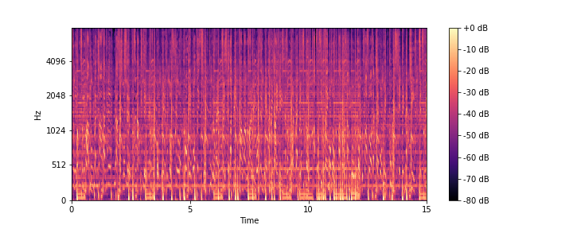

# Music-Genre-Classification
## Table of Contents
[Overview](#overview) 
[Introduction](#intro) 
[What is Audio Signal Processing?](#asp) 
[Data Preparation](#data-prep) 
[Exploratory Data Analysis](#EDA) 
[Deep Learning Models](#deep) 
[Summary](#summary) 
[Future Ideas](#future) 
[References](#references) 

## <a name="overview">Overview</a>

Music is everywhere. You can find yourself hearing all kinds of music as you go throughout your day - maybe some soft indie-rock at your local coffee shop, the latest pop songs over the radio, some electronic dance music in your fitness class. The options are endless. And even so, music continues to grow, adapt, and expand. New genres and subgenres continue to pop up and offer new music.

In this ever-expanding space, it's important to be able to classify songs to be able to group and categorize them in meaningful ways. As such, this project aims to tackle the popular problem of genre classification.

In a [previous project](https://github.com/kenshr/Music-Genre-Classification-with-Audio-Features) I addressed the same issue using audio features of songs, which were gathered from Spotify's web API, in order to determine their genres. While this project proved to be largely successful, I wanted to build on the same idea and make my models more adaptable. Rather than using audio features that need to be generated via a third party, this project will use deep learning models to perform genre classification on songs using raw audio.

The dataset[1](https://github.com/mdeff/fma) used for this project has 30 second clips of 8000 songs, equally balanced across 8 genres:
- Electronic
- Experimental
- Folk
- Hip-Hop
- Instrumental
- International
- Pop
- Rock

## <a name="asp">What is Audio Signal Processing?</a>

This section will serve as a primer to introduce and demystify some audio signal processing concepts that were employed in this project. If you are only interested in strictly data science, please feel free to skip to the [next section](#data-prep).

Audio, in essence, is the product of variations in air pressure over time. These changes are recorded at a specified sample rate, traditionally 44,100 samples per second (44.1 kHz), which gives us waveforms. As seen below, these waveforms offer large amounts of information within the span of even 1 second.

These waveforms can be stored in mp3's, wav files, and other audio file formats. This brings us to our starting point, with our data being in a .mp3 file format. One of the first issues to address is how to convert our data into a palatable format that can be input into our deep learning models, as they cannot process raw audio data. In order to overcome this, we use mel spectrograms like the one shown below.

Spectrograms are visual representations of a spectrum of frequencies from a signal as it varies over time.[3](https://en.wikipedia.org/wiki/Spectrogram#:~:text=A%20spectrogram%20is%20a%20visual,they%20may%20be%20called%20waterfalls.) Put simply, a spectrogram is a picture depicting audio visually. The raw audio is converted into a spectrogram using a mathematical technique called the Fourier Transform. The Fourier transform takes an audio snippet and breaks the sound down into constituent sine and cosine waves of corresponding amplitude. Doing so will convert our audio into the "spectrum of frequencies" mentioned above in the definition. The package we're using applies a Fast Fourier Tranform (FFT) algorithm multiple times across our passed-in audio to generate the spectrogram.

The "mel" component of the mel spectrogram refers to the mel scale. The mel scale is a method of scaling pitches to make equal distances in pitch sound equally distant to listeners. This is necessary because human hearing is innately better at hearing differences in low frequencies than differences in high frequencies. Therefore, after generating the spectrogram, the frequency axis is scaled accordingly. This can be seen in the graph above as the y-axis follows an exponential trend as it increases.

Coming back to the big picture, the main idea behind using mel spectrograms for our deep learning models is that they are in a visual format which CAN be processed in a neural network and they are scaled in such a way that the data is represented in a format similar to how a human perceives the sound.

## <a name="data-prep">Data Preparation</a>

## <a name="EDA">Exploratory Data Analysis</a>

## <a name="deep">Deep Learning Models</a>

## <a name="summary">Summary</a>

## <a name="future">Future Ideas</a>

## <a name="references">References</a>

1. [Dataset](https://github.com/mdeff/fma)
2. [Waveform Visualization](https://deepmind.com/blog/<article/wavenet-generative-model-raw-audio)
3. [What is a Spectrogram?](https://en.wikipedia.org/wiki/Spectrogram#:~:text=A%20spectrogram%20is%20a%20visual,they%20may%20be%20called%20waterfalls.)
4.